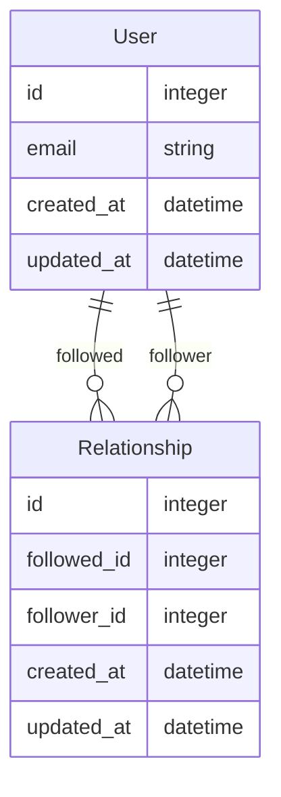

```mermaid
erDiagram
  User ||--o{ Relationship: "followed"
  User ||--o{ Relationship: "follower"
  
  User {
    id           integer
    email        string
    created_at   datetime
    updated_at   datetime
  }
  
  Relationship {
    id           integer
    followed_id  integer
    follower_id  integer
    created_at   datetime
    updated_at   datetime
  }
```

