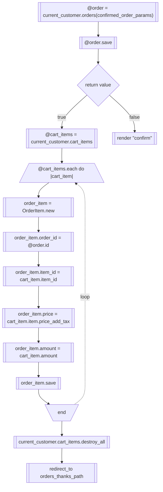

Flow Chart TD

```mermaid
flowchart TD
A[["@order = current_customer.orders(confirmed_order_params)"]] --> B[["@"order.save]]
B --> C{return value}
C -->|true| D[["@cart_items = current_customer.cart_items"]]
C{return value} -->|false| E[["render #34;confirm#34;"]]
D --> F[/"@cart_items.each do |cart_item|"\]
F --> G[["order_item = OrderItem.new"]]
G --> H[["order_item.order_id = @order.id"]]
H --> I[["order_item.item_id = cart_item.item_id"]]
I --> J[["order_item.price = cart_item.item.price_add_tax"]]
J --> K[["order_item.amount = cart_item.amount"]]
K --> L[["order_item.save"]]
L --> M[\"end"/]
M -.->|loop| F
M --> N[["current_customer.cart_items.destroy_all"]]
N --> O[["redirect_to orders_thanks_path"]]
```

