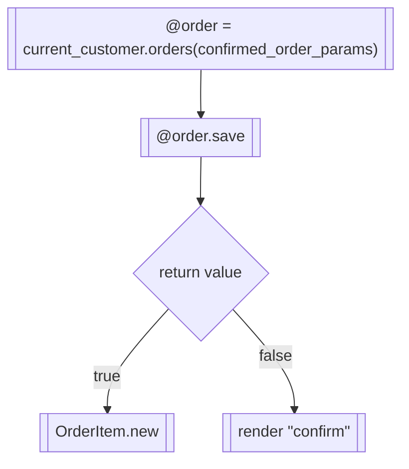

Flow Chart TD

```mermaid
flowchart TD
A[["@order = current_customer.orders(confirmed_order_params)"]] --> B
B[["@"order.save]] --> C{return value}
C{return value} -->|true| D[[OrderItem.new]]
C{return value} -->|false| E[["render #34;confirm#34;"]]
```

